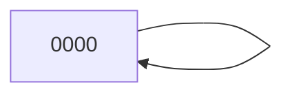
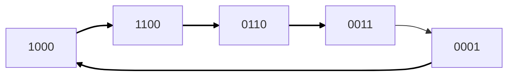
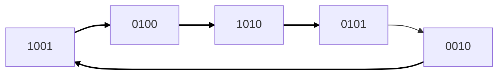
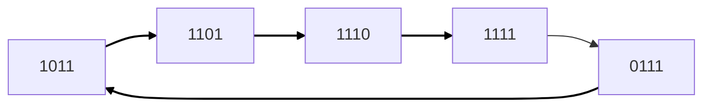

<h1 align = "center">Capter1</h1>

作业中出现的源码详见：https://github.com/DrNbnonono/Cryptography-Homework

## 1.18 线性递归序列

考虑下列定义在 $$ \mathbb{Z}_2 $$ 上的四级线性递归序列：$$ z_{i+4} = (z_i + z_{i+1} + z_{i+2} + z_{i+3}) \mod 2 $$

其中 $$ i \geq 0 $$。对其 16 种可能的初始向量 $$ (z_0, z_1, z_2, z_3) \in (\mathbb{Z}_2)^4 $$​，分别求出其生成的密钥流的周期。

|       Current state        |         Next state         | 周期 |
| :------------------------: | :------------------------: | :--: |
| $$((x_3, x_2, x_1, x_0))$$ | $$((x_3, x_2, x_1, x_0))$$ |      |
|            0000            |            0000            |  1   |
|            0001            |            1000            |  5   |
|            0010            |            1001            |  5   |
|            0011            |            0001            |  5   |
|            0100            |            1010            |  5   |
|            0101            |            0010            |  5   |
|            0110            |            0011            |  5   |
|            0111            |            1011            |  5   |
|            1000            |            1100            |  5   |
|            1001            |            0100            |  5   |
|            1010            |            0101            |  5   |
|            1011            |            1101            |  5   |
|            1100            |            0110            |  5   |
|            1101            |            1110            |  5   |
|            1110            |            1111            |  5   |
|            1111            |            0111            |  5   |









## 1.21 解码密文

下面的这段密文不知道具体的密码体制，给出清晰的分析过程，包括统计分析和进行的计算

### (d)未知具体密码

```
BNVSNSTHQCEELSSKKYERIFJKXUMBGYKAMQLJTYAVFBKVT DVBPVVRJYYLAOKYMPQSCGDLFSRLLPROYGESEBUUALRWXM MASAZLGLEDFJBZAVVPXWICGJXASCBYEHOSNMULKCEAHTQ OKMFLEBKFXLRRFDTZXCIWBJSICBGAWDVYDHAVFJXZIBKC GJIWEAHTTOEWTUHKRQVVRGZBXYIREMMASCSPBNLHJMBLR FFJELHWEYLMISTFVVYFJCMHYUYRUFSFMGESIGRLWALSWM NUHSIMYYITCCQPZSICEHBCCMZFEGVJYOCDEMMPGHVAAUM ELCMOEHVLTIPSUYILVGFLMVWDVYDBTHFRAYISYSGKVSUU HYHGGCKTMBLRX
```

#### 1. 统计各个字母出现的频率

编写python代码，对字母出现的频率进行统计

```python
from collections import Counter
# 给定的文字
text = ""
# 将所有字母转换为大写
text_upper = text.upper()
# 统计每个字母的出现次数
letter_counts = Counter(text_upper)
# 计算总字母数
total_letters = sum(letter_counts.values())
# 输出结果
for letter in "ABCDEFGHIJKLMNOPQRSTUVWXYZ":
    count = letter_counts.get(letter, 0)
    frequency = count / total_letters if total_letters > 0 else 0.0
    print(f"{letter}: {count} {frequency:.3f}")
```

得到如下的结果：

| 字母 | 次数 | 频率  | 字母 | 次数 | 频率  | 字母 | 次数 | 频率  |
| ---- | ---- | ----- | ---- | ---- | ----- | ---- | ---- | ----- |
| A    | 17   | 0.045 | B    | 17   | 0.045 | C    | 18   | 0.047 |
| D    | 9    | 0.024 | E    | 20   | 0.052 | F    | 17   | 0.045 |
| G    | 16   | 0.042 | H    | 16   | 0.042 | I    | 15   | 0.039 |
| J    | 12   | 0.031 | K    | 13   | 0.034 | L    | 23   | 0.060 |
| M    | 22   | 0.058 | N    | 5    | 0.013 | O    | 7    | 0.018 |
| P    | 8    | 0.021 | Q    | 6    | 0.016 | R    | 15   | 0.039 |
| S    | 23   | 0.060 | T    | 13   | 0.034 | U    | 12   | 0.031 |
| V    | 21   | 0.055 | W    | 10   | 0.026 | X    | 9    | 0.024 |
| Y    | 22   | 0.058 | Z    | 7    | 0.018 |      |      |       |

#### 2. 猜测为仿射密码

按照字母出现的频率，排序从高到低依次是：$$S,L,Y,M,V,E,C,B,F,A,H,G,R,I,T,K,J,U,W,X,D,P,O,Z,Q,N$$​。编写python代码进行逆元运算，并判断替换是否合法。对出现频率为前六位的任意两对替换英文中字母出现频率为前六的 $$E,T,A,O,I,N$$ .代码思路如下，完整代码详见片头链接。

```python
from math import gcd
from itertools import permutations
def modular_inverse(a, modulus):#计算逆元
def affine_cipher_decryption(a, b, ciphertext):#解密
def validate_pairs(pair1, pair2):#检查映射是否合法
def main():
    # 测试所有高频字母的合法映射组合
```

一共找到了156对符合规范的映射组合，但是没有一对合理的明文，因此可能不是仿射密码。

#### 3.  猜测为代换密码

在这段密文中，频率出现高的单词较多，不太好从代换密码入手，尝试维吉尼亚密码

#### 4. 猜测为维吉尼亚密码

##### Kasiski测试法

编写代码用来寻找长度为3的字串可能的分组形式，最后的结果如下表所示：

```python
from collections import defaultdict
from math import gcd
from functools import reduce
def find_repeated_substrings_with_gcd(text, substring_length):
#找到文本中所有指定长度的重复子串，计算每个子串的位置、到起点的距离和距离的最大公因数。
# 输入测试密文（保持密文连贯，无分段）
text = ("")
# 子串长度
substring_length = 3
# 执行函数
results = find_repeated_substrings_with_gcd(text, substring_length)
```

| 子串 | 位置       | 到起点的距离 | 最大公因数 | 子串 | 位置       | 到起点的距离 | 最大公因数 |
| :--- | :--------- | :----------- | :--------- | :--- | :--------- | :----------- | :--------- |
| AVF  | [39, 171]  | [38, 170]    | 2          | VVR  | [50, 199]  | [49, 198]    | 1          |
| GES  | [78, 258]  | [77, 257]    | 1          | MMA  | [90, 210]  | [89, 209]    | 1          |
| MAS  | [91, 211]  | [90, 210]    | 30         | CGJ  | [112, 180] | [111, 179]   | 1          |
| ASC  | [116, 212] | [115, 211]   | 1          | EAH  | [131, 185] | [130, 184]   | 2          |
| AHT  | [132, 186] | [131, 185]   | 1          | SIC  | [159, 286] | [158, 285]   | 1          |
| WDV  | [165, 339] | [164, 338]   | 2          | DVY  | [166, 340] | [165, 339]   | 3          |
| VYD  | [167, 341] | [166, 340]   | 2          | EMM  | [209, 305] | [208, 304]   | 16         |
| MBL  | [222, 369] | [221, 368]   | 1          | BLR  | [223, 370] | [222, 369]   | 3          |

此外，还尝试了字串长度为2的字符串，得到的结果中公因数6出现的次数较多，合理猜测6即为这段维吉尼亚密码的分组形式。

##### 重合指数法

编写代码，测试不同的分组得到的重合指数的值，得到以下数据，分组尝试为1-10

```python
def calculate_index_of_coincidence(text, group_size):
    """
    计算给定密文分组后的每组重合指数和平均重合指数。
    :param text: 输入密文字符串
    :param group_size: 分组大小
    :return: 每组重合指数及平均值
    """
# 分组，将密文划分为 group_size 个组
# 计算各组的重合指数
# 计算平均重合指数
# 用户输入密文和分组设置
```

| 分组大小 | 各组重合指数                                                 | 平均重合指数 |
| :------- | :----------------------------------------------------------- | :----------- |
| 1        | [0.041]                                                      | 0.041        |
| 2        | [0.044, 0.046]                                               | 0.045        |
| 3        | [0.045, 0.048, 0.048]                                        | 0.047        |
| 4        | [0.043, 0.056, 0.045, 0.047]                                 | 0.048        |
| 5        | [0.047, 0.041, 0.04, 0.043, 0.037]                           | 0.042        |
| 6        | [0.053, 0.061, 0.055, 0.071, 0.056, 0.07]                    | 0.061        |
| 7        | [0.04, 0.045, 0.044, 0.038, 0.051, 0.033, 0.046]             | 0.042        |
| 8        | [0.058, 0.056, 0.051, 0.046, 0.038, 0.065, 0.043, 0.05]      | 0.051        |
| 9        | [0.046, 0.044, 0.042, 0.036, 0.04, 0.04, 0.041, 0.045, 0.062] | 0.044        |
| 10       | [0.065, 0.041, 0.024, 0.047, 0.041, 0.044, 0.05, 0.047, 0.053, 0.051] | 0.046        |

从数据中不难看出，分组为6的时候，得到的重合指数最为合理。那便猜测分组为6，接下来进行对密钥对的破解

##### 计算 $$ M_g $$

- 对于每个密钥位置 $$ i $$（假设密钥长度为 $$ m $$，则 $$ 1 \leq i \leq m $$），计算 $$ M_g $$ 值：

$$
M_g = \sum_{j=0}^{25} \frac{p_j \cdot f_{j+g}}{n'}
$$

其中：

  - $$ p_j $$ 是英语中第 $$ j $$ 个字母（$$ A=0, B=1, ..., Z=25 $$）的标准频率。
  - $$ f_{j+g} $$ 是密文子串 $$ y_i $$ 中第 $$ j + g $$ 个字母的频数（下标对 26 取模）。
  - $$ n' $$ 是子串 $$ y_i $$​ 的长度。

编写代码对 $$ M_g $$ 进行计算：
```python
# 英文字母出现频率表 (A-Z)
ENGLISH_LETTER_FREQUENCIES = [
    0.082, 0.015, 0.028, 0.043, 0.127, 0.022, 0.020, 0.061, 0.070, 0.002,
    0.008, 0.040, 0.024, 0.067, 0.075, 0.019, 0.001, 0.060, 0.063, 0.091,
    0.028, 0.010, 0.023, 0.001, 0.020, 0.001
]
def calculate_mg_for_group(group, shift):
   #计算单个组在特定移位下的 M_g 值。
def calculate_mg_values(cipher_text, group_size):
   #计算密文分组后所有组和所有移位方案的 M_g 值。
def decrypt_vigenere(cipher_text, key):
   #使用维吉尼亚密钥解密密文，并返回小写字母。
# 用户输入密文和分组设置
cipher_text = input("请输入密文: ").upper()
group_size = int(input("请输入分组大小: "))
# 计算并输出每组的 M_g 值
# 询问用户密钥
```

最终得到的 $$ M_g $$​ 表统计如下：

| 第一组            | 第二组            | 第三组            | 第四组            | 第五组            | 第六组            |
| ----------------- | ----------------- | ----------------- | ----------------- | ----------------- | ----------------- |
| 移位 A: 0.041     | 移位 A: 0.041     | 移位 A: 0.053     | 移位 A: 0.042     | 移位 A: 0.038     | 移位 A: 0.029     |
| 移位 B: 0.036     | 移位 B: 0.035     | 移位 B: 0.036     | 移位 B: 0.043     | 移位 B: 0.043     | 移位 B: 0.034     |
| 移位 C: 0.034     | 移位 C: 0.032     | 移位 C: 0.031     | 移位 C: 0.04      | 移位 C: 0.049     | 移位 C: 0.036     |
| 移位 D: 0.034     | 移位 D: 0.042     | 移位 D: 0.038     | 移位 D: 0.043     | 移位 D: 0.035     | 移位 D: 0.027     |
| 移位 E: 0.044     | 移位 E: 0.037     | ==移位 E: 0.061== | 移位 E: 0.037     | 移位 E: 0.043     | 移位 E: 0.037     |
| 移位 F: 0.038     | 移位 F: 0.037     | 移位 F: 0.036     | 移位 F: 0.032     | 移位 F: 0.039     | 移位 F: 0.049     |
| 移位 G: 0.04      | 移位 G: 0.037     | 移位 G: 0.03      | 移位 G: 0.031     | 移位 G: 0.042     | 移位 G: 0.034     |
| 移位 H: 0.035     | ==移位 H: 0.068== | 移位 H: 0.037     | 移位 H: 0.032     | 移位 H: 0.035     | 移位 H: 0.041     |
| 移位 I: 0.046     | 移位 I: 0.038     | 移位 I: 0.046     | 移位 I: 0.029     | 移位 I: 0.032     | 移位 I: 0.044     |
| 移位 J: 0.035     | 移位 J: 0.032     | 移位 J: 0.028     | 移位 J: 0.033     | 移位 J: 0.035     | 移位 J: 0.045     |
| 移位 K: 0.036     | 移位 K: 0.028     | 移位 K: 0.034     | 移位 K: 0.052     | 移位 K: 0.035     | 移位 K: 0.038     |
| 移位 L: 0.037     | 移位 L: 0.046     | 移位 L: 0.036     | 移位 L: 0.036     | 移位 L: 0.035     | 移位 L: 0.04      |
| 移位 M: 0.045     | 移位 M: 0.032     | 移位 M: 0.039     | 移位 M: 0.03      | 移位 M: 0.034     | 移位 M: 0.035     |
| 移位 N: 0.036     | 移位 N: 0.039     | 移位 N: 0.04      | 移位 N: 0.04      | 移位 N: 0.047     | 移位 N: 0.038     |
| 移位 O: 0.028     | 移位 O: 0.036     | 移位 O: 0.044     | ==移位 O: 0.069== | 移位 O: 0.035     | 移位 O: 0.034     |
| 移位 P: 0.041     | 移位 P: 0.035     | 移位 P: 0.044     | 移位 P: 0.043     | 移位 P: 0.029     | 移位 P: 0.028     |
| 移位 Q: 0.042     | 移位 Q: 0.034     | 移位 Q: 0.039     | 移位 Q: 0.033     | 移位 Q: 0.04      | 移位 Q: 0.04      |
| 移位 R: 0.033     | 移位 R: 0.039     | 移位 R: 0.042     | 移位 R: 0.034     | ==移位 R: 0.063== | 移位 R: 0.037     |
| 移位 S: 0.035     | 移位 S: 0.046     | 移位 S: 0.035     | 移位 S: 0.045     | 移位 S: 0.042     | 移位 S: 0.04      |
| ==移位 T: 0.062== | 移位 T: 0.041     | 移位 T: 0.039     | 移位 T: 0.029     | 移位 T: 0.034     | 移位 T: 0.039     |
| 移位 U: 0.04      | 移位 U: 0.046     | 移位 U: 0.037     | 移位 U: 0.033     | 移位 U: 0.038     | 移位 U: 0.054     |
| 移位 V: 0.032     | 移位 V: 0.034     | 移位 V: 0.034     | 移位 V: 0.034     | 移位 V: 0.038     | 移位 V: 0.037     |
| 移位 W: 0.033     | 移位 W: 0.041     | 移位 W: 0.034     | 移位 W: 0.032     | 移位 W: 0.031     | 移位 W: 0.033     |
| 移位 X: 0.045     | 移位 X: 0.036     | 移位 X: 0.037     | 移位 X: 0.034     | 移位 X: 0.038     | 移位 X: 0.036     |
| 移位 Y: 0.034     | 移位 Y: 0.036     | 移位 Y: 0.035     | 移位 Y: 0.043     | 移位 Y: 0.042     | ==移位 Y: 0.065== |
| 移位 Z: 0.038     | 移位 Z: 0.031     | 移位 Z: 0.037     | 移位 Z: 0.053     | 移位 Z: 0.03      | 移位 Z: 0.033     |

通过对数据的分析，最后确定密钥为  $$ THEORY(theory) $$ ，按照分组解密后，得到的明文为

```bash
igrewuaamongslowtalkersmeninparticularwhodroppedwordsafewatatimelikebeansinahillandwhenigottominneapoliswherepeopletookalakewobegoncommatomeantheendofastoryicouldntspeakawholesentenceincompanyandwasconsiderednottoobrightsoienrolledinasfeechcoursetaughtbyorvillesandthefounderofreflexiverelaxologyaselfhypnotictechniquethatenabledapersontospeakuptothreehundredwordsperminute
```

笔者利用小学的英语知识拼尽全力方才战胜，最后的明文为：

```
I grew up among slow talkers, men in particular, who dropped words a few at a time like beans in a hill. And when I got to Minneapolis, where people took a Lake Wobegon comma to mean the end of a story, I couldn't speak a whole sentence in company and was considered not too bright. So I enrolled in a speech course taught by Orville Sand, the founder of reflexive relaxology, a self-hypnotic technique that enabled a person to speak up to three hundred words per minute.
```


